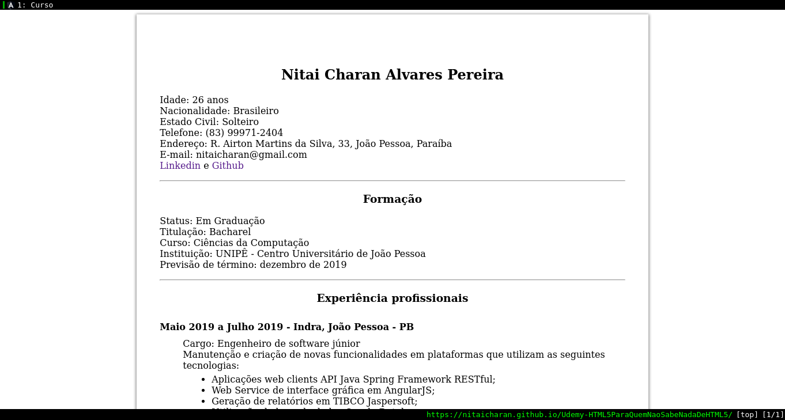

## Udemy-HTML5PQNSNDHTML5
<!-- PROJECT SHIELDS -->
![Angular][angular-shield]
![TypeScript][typescript-shield]
![HTML5][html5-shield]
![CSS3][css3-shield]
![SASS][sass-shield]
![VIM][vim-shield]
![Udemy][udemy-shield]

Project available to access at: https://nitaicharan.github.io/Udemy-HTML5PQNSNDHTML5/



## Deploy
```
ng build
index.html:base:"/" -> index.html:base:"/Udemy-HTML5PQNSNDHTML5/"
cp dist/curso/index.html dist/curso/404.html

git add -A
git commit -m <titule> <message>
git push origin <branch>
git push --delete origin gh-pages
git subtree push --prefix dist/curso origin gh-pages
```
## Informações sobre o curso
HTML5 para quem não sabe nada de HTML5
<br>Aprenda HTML 5 de forma simples e rápida, da mesma forma que alunos de Graduação aprendem, sem precisar fazer Faculdade.

URL: https://www.udemy.com/course/aprendahtml/

### Requirements
- O estudante deve estar familiarizado com os procedimentos de instalação de programas em seu computador.

### Description
Você deve estar pensando:

***"Existem milhares de cursos HTML na Internet, o que este curso têm de especial?"***

Segue uma lista:

1. Este curso é focado nos conceitos da versão 5 do HTML. Muitos cursos ainda usam conceitos ultrapassados, de HTML 4.01 (de 1999) e XHTML (de 2000).

1. Este curso faz parte da disciplina Desenvolvimento Web, que leciono para alunos de graduação. 

1. O curso ensina como hospedar suas páginas gratuitamente na Internet usando o GitHub Pages.

1. É 100% gratuito !

Este curso foi projetado para iniciantes e receberá atualizações a partir do seu feedback, ou seja, a partir da sua avaliação positiva e construtiva, este curso crescerá, incorporando conteúdos que te ajudarão a conhecer mais a linguagem e as tecnologias associadas.

Não perca tempo, inscreva-se no curso e comece a aprender HTML5 hoje mesmo!

**E compartilhe com seus amigos!**

#### Who this course is for:
- Qualquer um que deseja conhecer os fundamentos do HTML
- Alunos que desejam aprender diretamente na versão mais atual HTML a versão HTML5

#### Paulo Andrade, Ph.D.
Doutor em Computação e Especialista em Educação a Distância

***Obrigado por visitar meu perfil.***

Como eu posso te ajudar:

- Abaixo tem a lista dos meus cursos, alguns são gratuitos. Inscreva-se e veja se gosta do meu estilo de lecionar.

- Visite meu site (link aqui no perfil também) e cadastre-se na minha newsletter. Costumo enviar promoções dos meus cursos e outras oportunidades. No máximo dois emails por mês.

- Se você é meu aluno e tem alguma dúvida, coloque uma mensagem na área de perguntas e respostas. Eu verifico todos os dias.

- Use também o sistema de mensagens da plataforma.

**Um resumo sobre o que faço**

Sou especialista em Educação a Distância, Doutor em Computação Visual (2014) e Mestre em Computação Aplicada e Automação (2003), ambos pela Universidade Federal Fluminense. Sou Graduado em Computação pela Universidade do Estado do Rio de Janeiro (1994).

Tenho mais de 17 anos de experiência como Professor Universitário.

Atuo como coordenador de cursos de Graduação e Pós-Graduação desde 2002.

Trabalhei por mais de 10 anos como profissional de Tecnologia da Informação em empresas como IBM e Xerox.

Atuo como revisor técnico de livros para as áreas de Design e Computação.

Sou protetor de animais, o que significa que, diariamente, separo um tempinho para dar melhores condições de vida a animais abandonados. Adoro fazer isso.

Vivo na Cidade do Rio de Janeiro e moro na Barra da Tijuca. Aceito convites para um café!

Abraços e sucesso !

This project was generated with [Angular CLI](https://github.com/angular/angular-cli) version 8.3.13.

## Development server

Run `ng serve` for a dev server. Navigate to `http://localhost:4200/`. The app will automatically reload if you change any of the source files.

## Code scaffolding

Run `ng generate component component-name` to generate a new component. You can also use `ng generate directive|pipe|service|class|guard|interface|enum|module`.

## Build

Run `ng build` to build the project. The build artifacts will be stored in the `dist/` directory. Use the `--prod` flag for a production build.

## Running unit tests

Run `ng test` to execute the unit tests via [Karma](https://karma-runner.github.io).

## Running end-to-end tests

Run `ng e2e` to execute the end-to-end tests via [Protractor](http://www.protractortest.org/).

## Further help

To get more help on the Angular CLI use `ng help` or go check out the [Angular CLI README](https://github.com/angular/angular-cli/blob/master/README.md).

## Contact
[![Gmail][gmail-shield]][gmail-url]
[![LinkedIn][linkedin-shield]][linkedin-url]
[![Github][github-shield]][github-url]
[![Udemy][udemy-shield]][udemy-url]
[![Instagram][instagram-shield]][instagram-url]
[![Twitter][twitter-shield]][twitter-url]

<!-- MARKDOWN LINKS & IMAGES -->
<!-- https://www.markdownguide.org/basic-syntax/#reference-style-links -->

<!-- CONTACT SHIELDS -->
[linkedin-shield]: https://img.shields.io/badge/-LinkedIn-white.svg?logo=linkedin&colorB=0077B5&logoColor=white
[linkedin-url]: https://www.linkedin.com/in/nitaicharan/
[gmail-shield]: https://img.shields.io/badge/-Gmail-black.svg?logo=gmail&colorB=D14836&logoColor=white
[gmail-url]: mailto:niaicharan@gmail.com?subject=It%20comes%20from%20Github%20profile
[github-shield]: https://img.shields.io/badge/-Github-black.svg?logo=github&colorB=181717&logoColor=white
[github-url]: https://github.com/nitaicharan
[udemy-shield]: https://img.shields.io/badge/-Udemy-black.svg?logo=udemy&colorB=EC5252&logoColor=white
[udemy-url]: https://www.udemy.com/user/nitai-charan/
[instagram-shield]: https://img.shields.io/badge/-Instagram-black.svg?logo=instagram&colorB=EC5252&logoColor=white
[instagram-url]: https://www.instagram.com/nitaicharan/?hl=pt-br
[twitter-shield]: https://img.shields.io/badge/-Twitter-black.svg?logo=twitter&colorB=1DA1F2&logoColor=white
[twitter-url]: https://twitter.com/nitaicharan1
[facebook-shield]: https://img.shields.io/badge/-Facebook-black.svg?logo=facebook&colorB=4172B8&logoColor=white
[facebook-url]: https://www.facebook.com/NitaiCharan1

<!-- PROJECT SHIELDS -->
[html5-shield]: https://img.shields.io/badge/-HTML5-black.svg?logo=html5&colorB=E34F26&logoColor=white
[css3-shield]: https://img.shields.io/badge/-CSS3-black.svg?logo=css3&colorB=1572B6&logoColor=white
[sass-shield]: https://img.shields.io/badge/-SASS-black.svg?logo=sass&colorB=CC6699&logoColor=white
[angular-shield]: https://img.shields.io/badge/-Angular-black.svg?logo=angular&colorB=DD0031&logoColor=white
[vim-shield]: https://img.shields.io/badge/-Vim-black.svg?logo=vim&colorB=019733&logoColor=white
[java-shield]: https://img.shields.io/badge/-Java-black.svg?logoColor=white&logo=java&&colorB=007396
[javascript-shield]: https://img.shields.io/badge/-JavaScript-black.svg?logoColor=white&logo=javascript&&colorB=F7DF1E
[typescript-shield]: https://img.shields.io/badge/-TypeScript-black.svg?logoColor=white&logo=typescript&&colorB=007ACC
[react-shield]: https://img.shields.io/badge/-React-black.svg?logoColor=white&logo=react&colorB=61DAFB

## License
Copyright &copy; Nitai Charan. All rights reserved.

Licensed under the [GNU General Public License v3.0](LICENSE) license.
